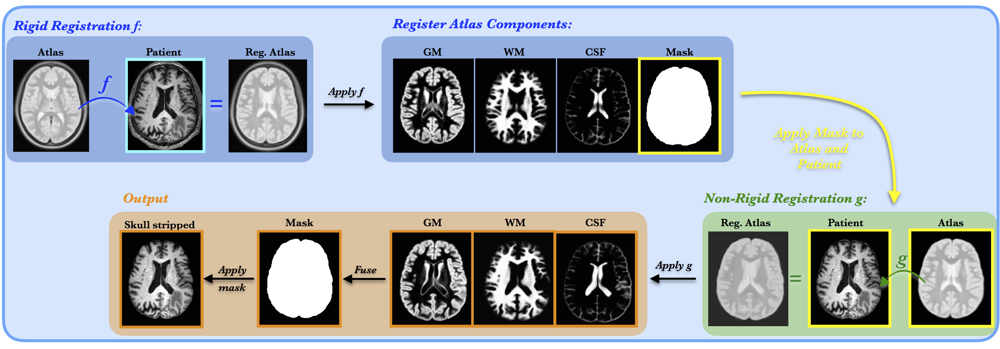

# Simple Skull Stripping (S3) 
 * Skull stripping tool with optional approximate segmentation of brain tissue based on atlas registration
 * Input: patient head scan
 * Output:
   * skull stripped scan, 
   * binary brain mask, 
   * probabilistic segmentation of grey matter (GM), white matter (WM) and cerbospinal fluid (CSF).
 * The solver works with any input head scan, however T1 non-contrast scan is preferred. The reason is that brain pathologies like lesions are less pronounce on T1 non-contrast scan, compare to other modalities like T1-contrast or FLAIR scan.
 * The tissue segmentations provide good approximation for healthy brains. However, they might not correctly estimate tissue in the regions with significant pathologies, like tumor.

# Method
The method is based on atlas registrations. Here we use atlas of normal adult brain anatomy extracted from [sri24](https://www.nitrc.org/projects/sri24/). The method consist of the following steps:

1. Compute rigid registration *f* between input brain scan and atlas (see the first blue box in figure below). Rigid registration is used, since the patient and atlas scan contains different anatomical structures like face, neck. In this case the deformable registration would result into artifical deformations.
2. Use *f* to map atlas brain mask and tissue segmentations to the patient space (second blue box). The registered mask is a coarse approximation of the patient brain mask. However, it might not correctly capture the complex brain anatomy. 
3. Use the registered atlas mask to mask patient and atlas scan (yellow arrow).
4. Compute non-rigid registration *g*, mapping the skull stripped atlas to the skull stripper patient (green box). Since now both scans have same size, the deformable registration can be used.  
5. Use *g* to map atlas tissue segmentations to the patient space (orange box). This leads to finer tissue segmentations accounting for complex patient structure.
6. Fuse the patient tissue segmentations into brain mask. This is mask is more refined compared to the first coarse mask.
7. Apply the refined mask to skull stripped the input image.


 

# Installation:

1) First install packages from requirements.txt

```
pip install -r requirements.txt
```

2) Install ANTs with instructions provided at https://github.com/ANTsX/ANTs/wiki/Compiling-ANTs-on-Linux-and-Mac-OS

3) Install NiftyReg with instructions provided at http://cmictig.cs.ucl.ac.uk/wiki/index.php/NiftyReg_install. The software come with experimental branch called s3_ants which does not require NiftyReg installation, however this branch is still under development and might not be stable. However, if you can't install NiftyReg you can use this branch for skull stripping.

4) Set the path to the installed libraries by updating your ~/.profile or ~/.basrc file with the following lines, where the first line contains path to YOUR library:
```
export ANTSPATH=/home/jana/Work/Ants/stnava-ANTs-a430c38/antsbin/bin/
export PATH=$PATH:$ANTSPATH

export NIFTYREG_INSTALL=/home/jana/Work/libs/nifty_reg-1.3.9/niftyreg_install
export PATH=${PATH}:${NIFTYREG_INSTALL}/bin
```

# Run

Parameters:

1) -i : Path to the input modality, nifti file (.nii or nii.gz) (Mandatory)

2) -o : Path to the output folder (Optional)

3) -t : Use this when the tissue registrations for white matter, gray matter and cerebral spinal fluid are required (Optional)

# Example 
Folder s3/example/ contains test scan called T1.nii To apply the s3 method to the example scan:
```
cd s3
python s3.py -i example/T1.nii
```
This command would apply the skull stripping procedure on the input file "t1.nii" file and stores the output, the brain mask and stripped brain scan, in the same folder as the input file. 

----------------------------------------------------------
To save results to differen than the input folder, use flag -o
```
python s3.py -i example/T1.nii -o output 
```
Where output is the name of the output folder. If the specified output folder does not exist, it will be created.

----------------------------------------------------------

To enable computation of tissue segmentation use flag -t:
```
python s3.py -i example/T1.nii -o output/  -t 
```
This command performs skulls stripping of input image, and outputs the brain mask, skull-stripped scan, soft segmentations of white, grey matter and csf.

# References
Please cite: Lipkova et al., *Personalized Radiotherapy Design for Glioblastoma Using Mathematical Models, Multimodal Scans and Bayesian Inference*, (accepted to IEEE TMI, currently available at https://arxiv.org/pdf/1807.00499.pdf)

# Acknowledgement
* Esther Albers, Enes Senel

:panda_face:
